**Task 1: Set Up Initial Infrastructure**

1.  **Create a Kubernetes Cluster on GKE (or equivalent tool)**

<!-- -->

1.  Log in to your Google Cloud Console

- <https://console.cloud.google.com/>

> Step 1: Create project after logging into the google cloud console.
>
> 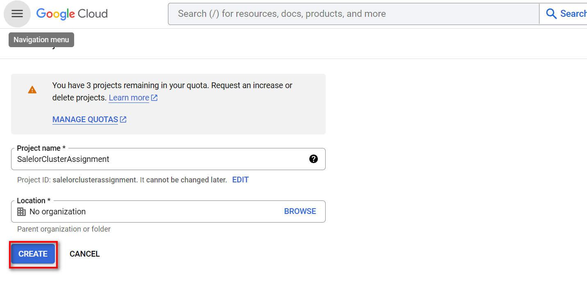 style="width:6.26806in;height:3.00903in" />
>
> Step 2: Select the project that was created in Step 1

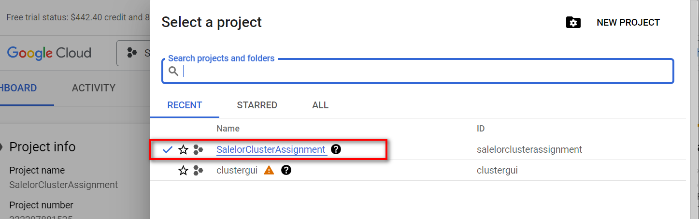

2.  Navigate to the Kubernetes Engine section and click "Create
    Cluster."

<!-- -->

1.  Click on
    
    at the left corner of the page and select **Kubernetes Engine** and
    then select **Clusters** option.

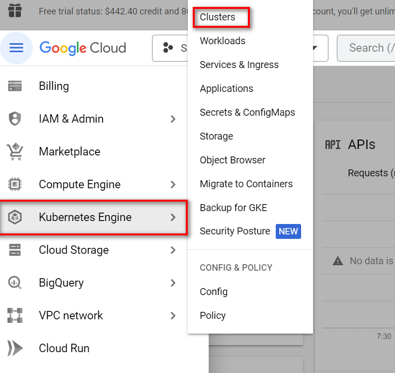

2.  Click on **ENABLE** button to enable Kubernetes Engine API

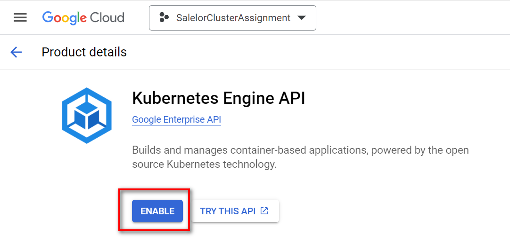

3.  Click on the **CREATE** button to create the cluster.

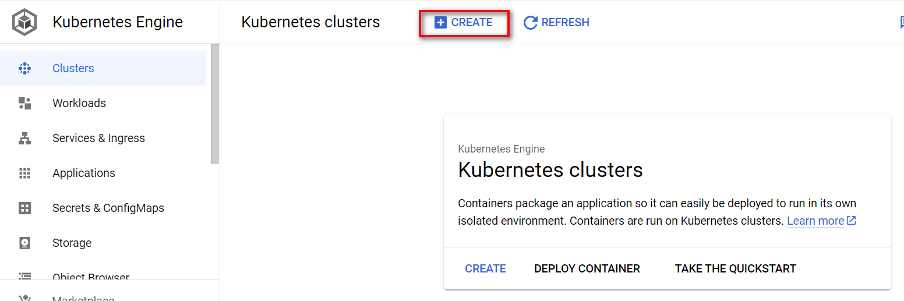

4.  Configure your cluster settings, such as the cluster name, location,
    and node pool configuration.

<!-- -->

1.  Switch to Standard Cluster by selecting **SWITCH TO STANDARD
    CLUSTER** button.

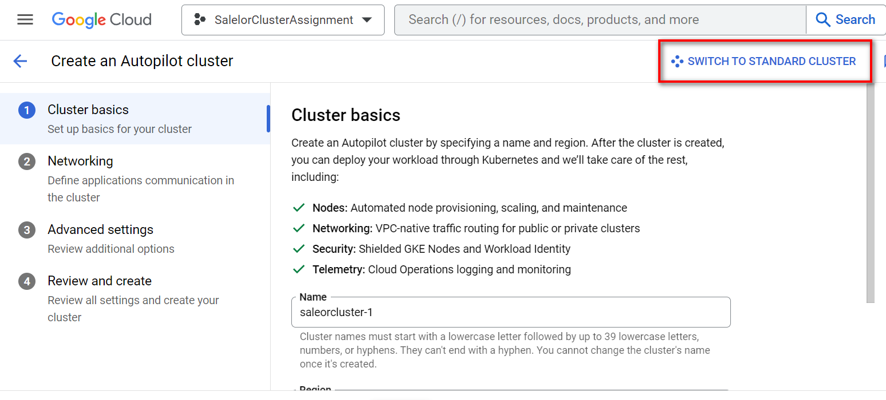

2.  Click on **CREATE** Button after entering the cluster names and
    selecting the cluster locations to provision GKE cluster.

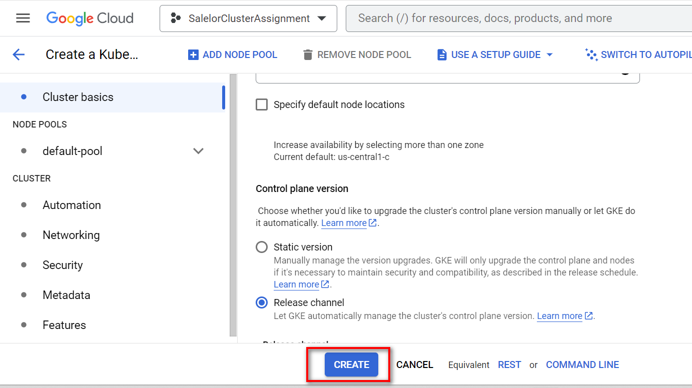

1.  Cluster details are as follows:

- Cluster name: saleorcluster1

- Location: us-central1-c

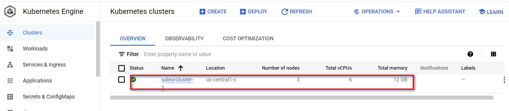

2.  Node Pools Details

- Node pool name: default-pool

- Autoscaling enabled and maximum number of nodes are configured to 5.

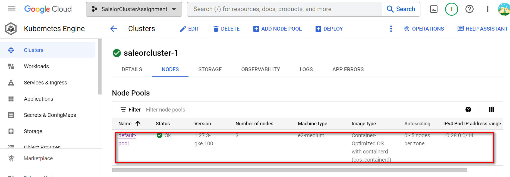

2.  **Install and configure kubectl to manage your Kubernetes cluster.**

<!-- -->

1)  Installing kubectl on the Local Machines

    1.  curl -LO
        https://dl.k8s.io/release/v1.27.4/bin/linux/amd64/kubectl

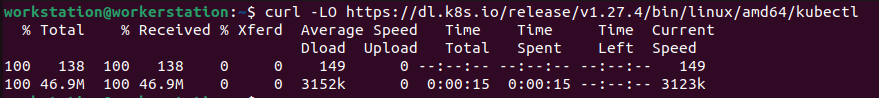

     2.  install -o root -g root -m 0755 kubectl /usr/local/bin/kubectl

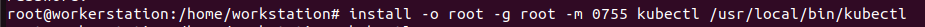

2)  Installing **gcloud cli** on the local machine

    1.  Follow instructions given in this url
        [**https://cloud.google.com/sdk/docs/install#linux**](https://cloud.google.com/sdk/docs/install#linux)

> Run below commands:

- curl -O
  https://dl.google.com/dl/cloudsdk/channels/rapid/downloads/google-cloud-cli-444.0.0-linux-x86_64.tar.gz

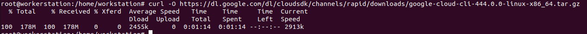

- tar -xf google-cloud-cli-444.0.0-linux-x86_64.tar.gz

- ./google-cloud-sdk/install.sh

- ./google-cloud-sdk/bin/gcloud init

> Follow the onscreen instructions:

- Select the project that we have created in the GKE cluster i.e.,
  option 1 in my case.

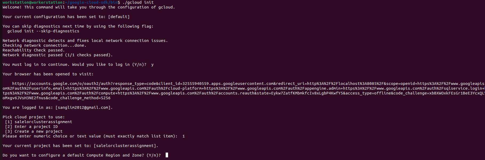

- Select the region that was created earlier i.e., option 7 in my case.

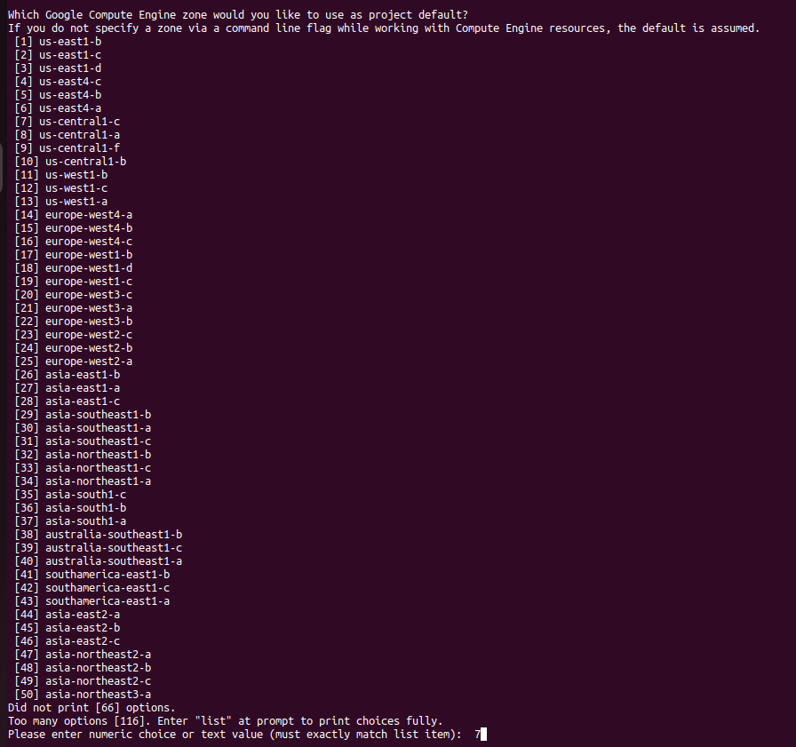

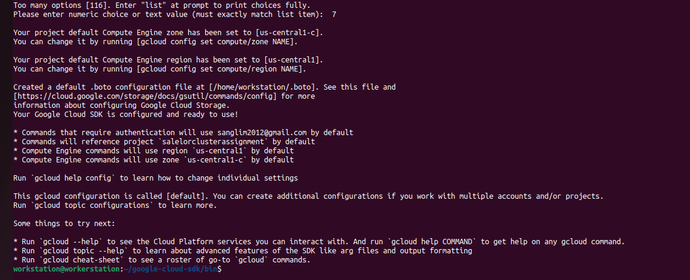

- Connecting to the GKE cluster

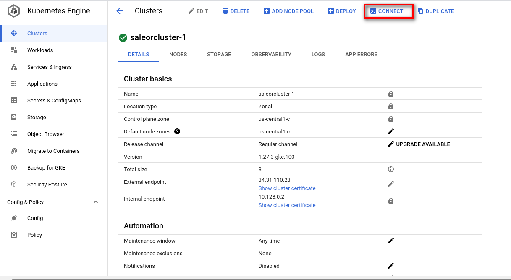

- Copy the below command which was shown when clicking on the CONNECT
  menu as shown above and run on the terminal to connect.

> gcloud container clusters get-credentials saleorcluster-1 --zone
> us-central1-c –project salelorclusterassignment

1.  Installing kubectl using gcloud

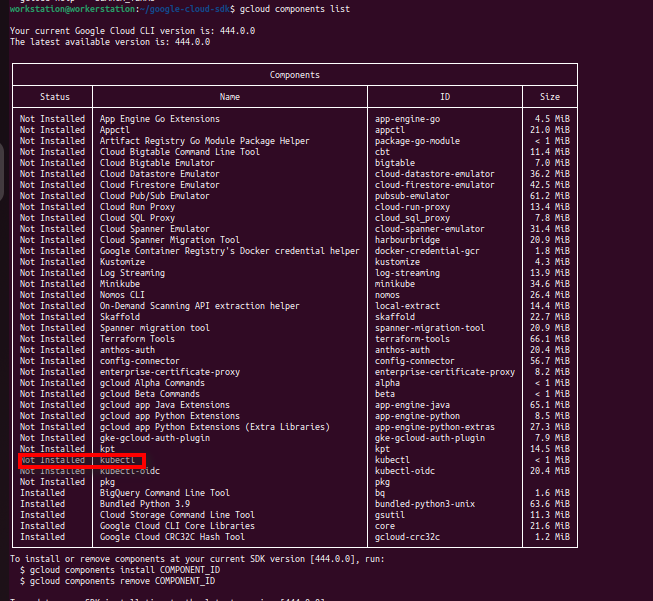

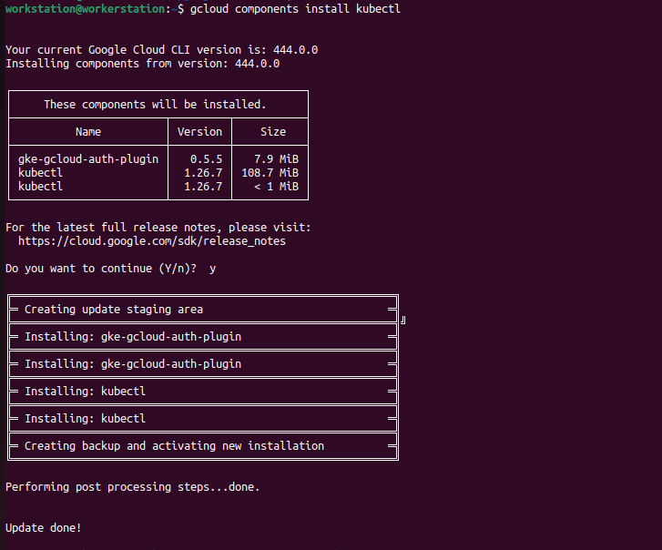

- Run **kubectl get deployments** to verify whether local machine could
  communicate with the GKE cluster

3.  **Set up a private GitHub repository to store your project files.**

<!-- -->

1)  Go to <https://github.com/> and login if you already have an account
    otherwise, register for new account.

2)  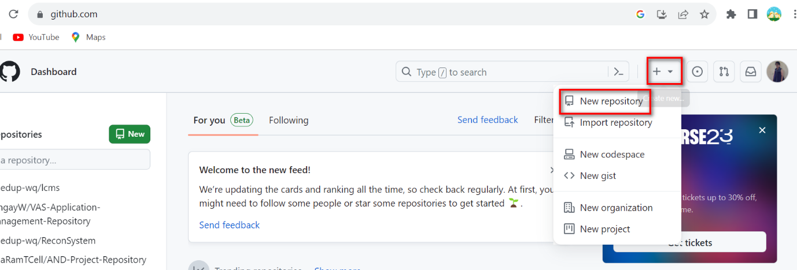Click
    on the '+' icon at the top right corner of the GitHub dashboard and
    select "New repository."

3)  Choose a meaningful repository name for your ISEC6000 Secure DevOps
    project.

4)  Select "Public" for the repository visibility.

5)  You need to add a description and choose whether to initialize the
    repository with a README. (Bonus marks if you have a proper README
    file.

6)  Click "Create repository."

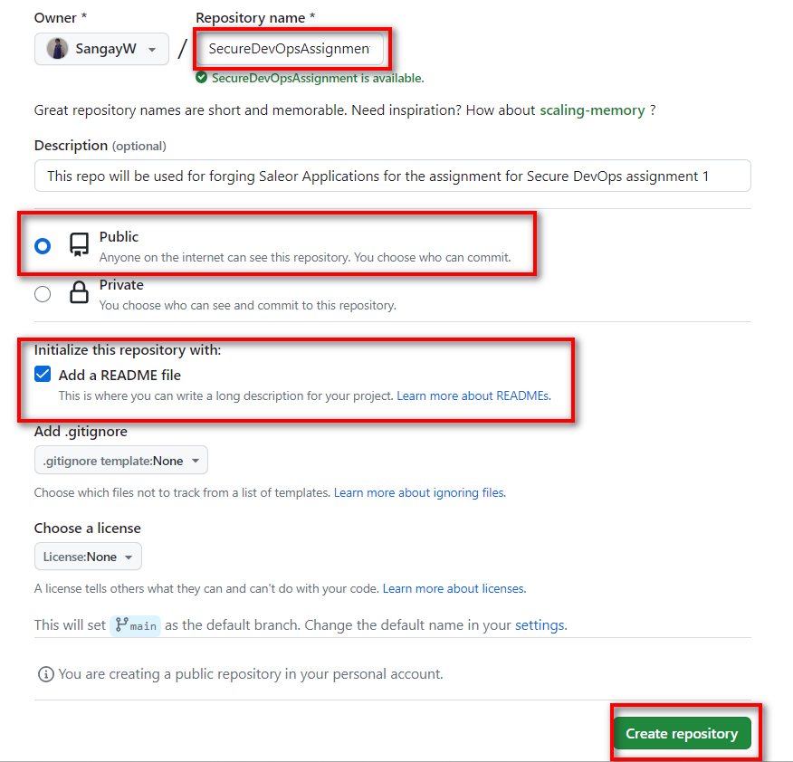

Output after clicking on Create repository.

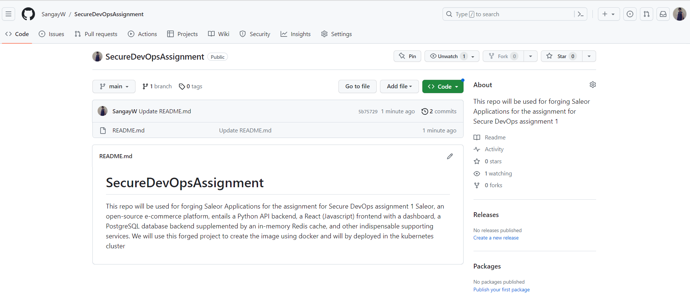
